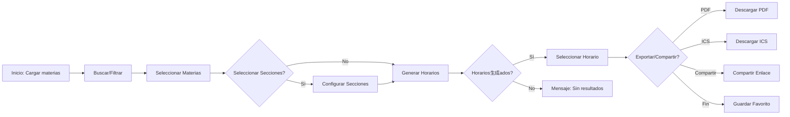

# Product Requirements Document (PRD)

<!-- AI: This is the core product document capturing "WHAT" to build. -->

## Document Info

| Field | Value |
|-------|-------|
| Product | Planificador de Horarios UCAB |
| Author | Oscar (Owner) |
| Date | 2026-02-28 |
| Version | 1.0 |
| Status | Draft |

---

## 1. Problem Statement

**For** estudiantes universitarios de la UCAB  
**Who** necesitan planificar su horario académico cada semestre  
**The** Planificador de Horarios UCAB  
**Is a** aplicación web estática (SPA)  
**That** genera automáticamente todas las combinaciones de horarios posibles sin conflictos  
**Unlike** WebUCAB (solo consulta) y Excel (manual y propenso a errores)  
**Our product** ofrece generación automática con filtros por campus, selección prioritaria/candidata, y exportación a PDF/calendario

---

## 2. User Stories & Automated Acceptance Criteria

### Epic: Selección de Materias

| ID | User Story | Priority | Acceptance Criteria (Gherkin) |
|----|------------|----------|-------------------------------|
| US-001 | Como estudiante, quiero buscar materias por código o nombre para encontrar rápidamente lo que necesito | P1 | **Scenario:** Búsqueda exitosa **Given** el usuario está en la lista de materias **When** escribe "INF" en el filtro de búsqueda **Then** solo muestran las materias que contienen "INF" en código o título |
| US-002 | Como estudiante, quiero seleccionar materias como "prioritarias" o "candidatas" para definir mi estrategia de inscripción | P1 | **Scenario:** Selección de prioridad **Given** el usuario está en modo selección de materia **When** hace clic en una materia **Then** la materia se marca con color rojo (prioritaria) o amarillo (candidata) |
| US-003 | Como estudiante, quiero filtrar materias por campus (Caracas, Valencia, San Cristóbal) para ver solo las disponibles en mi sede | P1 | **Scenario:** Filtro por campus **Given** el usuario selecciona "Caracas" en el filtro de campus **When** la lista de materias se actualiza **Then** solo muestran materias con secciones en Caracas |

### Epic: Generación de Horarios

| ID | User Story | Priority | Acceptance Criteria (Gherkin) |
|----|------------|----------|-------------------------------|
| US-004 | Como estudiante, quiero generar todos los horarios posibles con mis materias seleccionadas para elegir el mejor | P1 | **Scenario:** Generación exitosa **Given** el usuario seleccionó al menos una materia prioritaria **When** hace clic en "Generar Horarios" **Then** el sistema muestra todas las combinaciones válidas sin conflictos de horario |
| US-005 | Como estudiante, quiero navegar entre los diferentes horarios generados para ver todas las opciones | P1 | **Scenario:** Navegación de resultados **Given** hay múltiples horarios generados **When** hace clic en "Siguiente" o "Anterior" **Then** muestra el siguiente/anterior horario de la lista |
| US-006 | Como estudiante, quiero filtrar solo secciones abiertas para evitar horarios con cupos llenos | P1 | **Scenario:** Filtro secciones abiertas **Given** el toggle "Solo secciones abiertas" está activo **When** se generan los horarios **Then** solo se incluyen secciones con disponibilidad |

### Epic: Exportación y Compartir

| ID | User Story | Priority | Acceptance Criteria (Gherkin) |
|----|------------|----------|-------------------------------|
| US-007 | Como estudiante, quiero exportar mi horario a PDF para imprimirlo o guardarlo | P2 | **Scenario:** Exportar a PDF **Given** hay un horario seleccionado **When** hace clic en "Exportar PDF" **Then** se descarga un archivo PDF con el horario visual |
| US-008 | Como estudiante, quiero exportar mi horario a formato de calendario (ICS) para importarlo a Google Calendar | P2 | **Scenario:** Exportar a ICS **Given** hay un horario seleccionado **When** hace clic en "Exportar a Calendario" **Then** se descarga un archivo .ics que puede importarse a calendarios |
| US-009 | Como estudiante, quiero compartir mi horario por WhatsApp para pedir opinión a familiares o amigos | P2 | **Scenario:** Compartir horario **Given** hay un horario seleccionado **When** hace clic en "Compartir" **Then** se abre el nativo share dialog del sistema o se copia el enlace |

### Epic: Persistencia

| ID | User Story | Priority | Acceptance Criteria (Gherkin) |
|----|------------|----------|-------------------------------|
| US-010 | Como estudiante, quiero que mi selección se guarde automáticamente para no perderla al recargar la página | P2 | **Scenario:** Persistencia local **Given** el usuario tiene materias seleccionadas **When** recarga la página **Then** la selección se restaura automáticamente desde localStorage |
| US-011 | como estudiante, quiero guardar horarios favoritos para compararlos entre sí | P2 | **Scenario:** Guardar favorito **Given** hay un horario generado **When** hace clic en "Guardar Favorito" **Then** el horario se guarda en localStorage y puede recuperarse después |

---

## 3. Data & Observability (New)

### Analytics Events

| Event Name | Trigger | Properties (JSON Schema) | Business Question |
|------------|---------|--------------------------|-------------------|
| `page_loaded` | Página principal carga | `{ "timestamp": "ISO8601" }` | ¿Cuántos usuarios acceden? |
| `subject_selected` | Usuario selecciona materia | `{ "subjectId": "string", "selectionType": "priority\|candidate" }` | ¿Qué materias son más populares? |
| `generate_clicked` | Usuario hace clic en generar | `{ "priorityCount": "number", "candidateCount": "number" }` | ¿Cuántas materias seleccionan? |
| `schedule_generated` | Horario generado exitosamente | `{ "schedulesCount": "number", "generationTimeMs": "number" }` | ¿Cuántas combinaciones se generan? |
| `export_pdf_clicked` | Usuario exporta a PDF | `{ "scheduleIndex": "number" }` | ¿Cuántos usan exportar? |
| `export_ics_clicked` | Usuario exporta a calendario | `{ "scheduleIndex": "number" }` | ¿Cuántos usan calendario? |
| `share_clicked` | Usuario comparte horario | `{ "method": "whatsapp\|clipboard\|native" }` | ¿Cómo comparten? |
| `filter_applied` | Usuario aplica filtro | `{ "filterType": "string", "value": "string" }` | ¿Qué filtros usan más? |

### SLIs & SLOs (Reliability)

| Metric Type | SLI (Indicator) | SLO (Objective) | Alert Threshold |
|-------------|-----------------|----------------|-----------------|
| **Disponibilidad** | App carga correctamente | 99.5% / mes | Error al cargar > 1% |
| **Latencia** | Tiempo hasta primer horario generado | < 3s para 10 materias | > 5s |
| **Tiempo de carga** | LCP (Largest Contentful Paint) | < 2.5s | > 4s |
| **Tasa de éxito** | Usuarios que generan al menos 1 horario | > 70% | < 50% |

---

## 4. High-Level Requirements

### Functional Requirements

| ID | Requirement | Priority |
|----|-------------|----------|
| FR-001 | El sistema debe permitir buscar materias por código, nombre o título | Must Have |
| FR-002 | El sistema debe permitir filtrar materias por campus (Caracas, Valencia, San Cristóbal) | Must Have |
| FR-003 | El sistema debe permitir marcar materias como "prioritarias" o "candidatas" | Must Have |
| FR-004 | El sistema debe generar todas las combinaciones de horarios sin conflictos de horario | Must Have |
| FR-005 | El sistema debe mostrar solo secciones abiertas cuando el filtro está activo | Must Have |
| FR-006 | El sistema debe exportar horarios a formato PDF | Should Have |
| FR-007 | El sistema debe exportar horarios a formato ICS (calendario) | Should Have |
| FR-008 | El sistema debe permitir compartir horarios via Web Share API | Should Have |
| FR-009 | El sistema debe persistir la selección en localStorage | Should Have |
| FR-010 | El sistema debe guardar horarios favoritos en localStorage | Should Have |
| FR-011 | El sistema debe mostrar un indicador de progreso durante la generación | Should Have |

### Non-Functional Requirements

| Category | Requirement |
|----------|-------------|
| Performance | Page load < 2.5s (LCP) |
| Performance | Generación de horarios < 3s para 10 materias |
| Performance | Vue.js tree-shakeado ( build con Vite) |
| Security | No almacenar datos sensibles del usuario |
| Security | Todos los recursos deben cargarse via HTTPS |
| Availability | Debe funcionar offline (localStorage para datos) |
| Accessibility | Cumplir WCAG 2.1 nivel AA |
| Browser Support | Chrome, Firefox, Safari, Edge (versiones actuales) |

### Architectural Alignment

*El proyecto cumple con la arquitectura definida en:* `docs/architecture/SAD.md`
- **Tipo:** Single Page Application (SPA) estática
- **Framework:** Vue 3 (migración a Vite planificada)
- **Hosting:** GitHub Pages
- **Data:** localStorage para persistencia, JSON estático para datos de cursos

---

## 5. Rollout & Risk Strategy (New)

### Estrategia de Despliegue
- **Tipo:** GitHub Pages (estático)
- **Proceso:** Push a main branch → GitHub Actions → Deploy automático
- **Rollback:** Revertir commit.previous

### Condiciones de Kill Switch
*No aplica directamente en GitHub Pages. La estrategia es:*
1. **Testing manual** antes de cada deploy
2. **Feature flags** mediante código (variables de configuración)
3. **Ramas de desarrollo** para features experimentales

---

## 6. UX Guidelines

### Design Principles

1. **Simplicidad primero:** Cada screen debe tener una sola acción principal clara
2. **Feedback inmediato:** Toda acción del usuario debe tener respuesta visual
3. **Progresivo:** Comenzar simple, permitir complejidad avanzada opcional
4. **Accesible por defecto:** WCAG 2.1 AA mínimo
5. **Mobile-first:** Diseñar para móvil primero, desktop como enhancement

### Key User Flows

---

## 7. Scope & Timeline

### MVP Scope (Ya existente)
- [x] Selección de materias
- [x] Generación automática de horarios
- [x] Filtro por campus
- [x] Filtro solo secciones abiertas
- [x] Selección prioritaria/candidata

### Fase 1: Quick Wins (Semana 1)
- [x] Nueva tipografía (DM Sans + IBM Plex Sans)
- [x] Corregir contraste WCAG
- [x] Eliminar animaciones de pulso innecesarias
- [ ] Vue production build

### Fase 2: Funcionalidades Core (Semana 2-3)
- [-] Persistencia local (localStorage)
- [x] Exportar a PDF
- [-] Exportar a ICS
- [-] Compartir horario

### Fase 3: Experiencia Premium (Mes 2)
- [x] Rediseño visual completo
- [ ] Migración a Vite + Vue
- [ ] ARIA labels y focus management
- [ ] Google Analytics

### Fase 4: Growth (Mes 3+)
- [ ] Landing page
- [ ] Onboarding para nuevos usuarios
- [ ] Métricas y análisis

### Milestones

| Milestone | Target Date |
|-----------|-------------|
| Fase 1 Quick Wins | Semana 1 (Mar 2026) |
| Fase 2 Funcionalidades | Semana 2-3 (Mar 2026) |
| Fase 3 Premium | Mes 2 (Abr 2026) |
| Fase 4 Growth | Mes 3 (May 2026) |

---

## 8. Dependencies & Risks

### Dependencies

| Dependency | Status | Notes |
|------------|--------|-------|
| Vue 3 (CDN) | ✅ Estable | Migrar a Vite en Fase 3 |
| Bootstrap 5 | ✅ Estable | Puede reducirse con CSS custom |
| FontAwesome | ✅ Estable | Considerar icono más ligero |
| html2canvas | ✅ Estable | Usado para PDF export |
| results.json | ✅ Estable | Datos de cursos |
| GitHub Pages | ✅ Estable | Hosting del proyecto |

### Risks

| Risk | Impact | Probability | Mitigation |
|------|--------|-------------|------------|
| Datos desactualizados | Alto | Baja | Crear proceso de actualización (scraper) |
| GitHub Pages downtime | Medio | Muy baja | Usar CDN fallback si es necesario |
| Navegador no soportado | Bajo | Baja | Mostrar mensaje de compatibilidad |
| localStorage lleno | Bajo | Baja | Implementar cleanup de datos antiguos |

---

## 9. Competitor Analysis

### Competitive Landscape

| Herramienta | Fortalezas | Debilidades |
|------------|-----------|-------------|
| WebUCAB (oficial) | Datos oficiales | Solo consulta, no genera combinaciones |
| Excel/Google Sheets | Flexible | Manual, error-prone, sin validación |
| Horarios UCV | Para UCV | No aplica a UCAB |

### Unique Value Proposition

| Factor | Nuestra App | Competencia |
|--------|------------|-------------|
| Generación automática | ✅ Clave | ❌ No existe |
| Sin conflictos | ✅ Algoritmo | ❌ Manual |
| Específico UCAB | ✅ Datos reales | ⚠️ Genérico |
| Móvil-friendly | ✅ Vue responsive | ⚠️ Web oficial no |
| Exportar a calendario | ❌ Por hacer | ❌ No |

---

## 10. Métricas de Éxito

### KPIs de Producto

| Métrica | Target Inicial |
|---------|----------------|
| Tasa de generación exitosa | > 70% |
| Promedio de horarios generados | > 10 |
| Tiempo hasta primer horario | < 30s |
| Rebote | < 50% |

### KPIs de Engagement

| Métrica | Target |
|---------|--------|
| Horarios guardados por usuario | > 3 |
| Share rate | > 10% |

---

## Approval

| Role | Name | Date |
|------|------|------|
| Product Manager | Oscar | 2026-02-28 |
| Engineering Lead | | |
| Design Lead | | |
