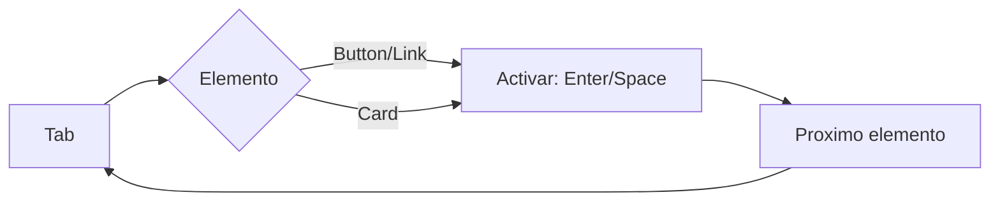

# UI Requirements Document (UIRD)

<!-- AI: Details for Visual Design and Frontend implementation. -->

## Document Info

| Field | Value |
|-------|-------|
| Project | Planificador de Horarios UCAB |
| Version | 1.0 |
| Status | Draft |
| Last Updated | 2026-02-28 |

---

## 1. Sitemap / Hierarchy

<!-- AI: Logical structure of the application -->

```
Home (index.html)
├── Header
│   ├── Logo/Título: "Planificador de Horarios UCAB"
│   └── Status Badge: "Datos Integrados"
│
├── Main Content (Grid: 2 columnas)
│   ├── Left Column: SectionSelector
│   │   ├── Mode Toggle (Prioridad/Candidata)
│   │   ├── Filter Panel
│   │   │   ├── Búsqueda por texto
│   │   │   ├── Filtro Campus
│   │   │   └── Toggle Solo Abiertas
│   │   └── Subject List
│   │       ├── Subject Cards
│   │       │   ├── Código + Título
│   │       │   ├── Badges (créditos, secciones)
│   │       │   └── Sections Expandables
│   │       └── Empty State
│   │
│   └── Right Column: ScheduleResults
│       ├── Navigation (Prev/Next)
│       ├── Schedule Display
│       │   ├── Vista List
│       │   └── Vista Grid (Tabla)
│       └── Actions
│           ├── Export PDF
│           ├── Export ICS
│           └── Share
│
├── Advanced Options (Collapsible)
│   ├── Tabs: SubjectSelector / CourseList
│   └── Legacy Views
│
└── Footer (opcional)
    └── Links: GitHub, Feedback
```

---

## 2. Design System References

### Color Palette

#### Primary Colors (Blue Académico)

| Token | Hex | Usage |
|-------|-----|-------|
| `--primary-900` | `#0d3b66` | Headers, emphasis |
| `--primary-700` | `#1a5276` | Primary buttons, active states |
| `--primary-500` | `#2563eb` | Links, accents |
| `--primary-300` | `#60a5fa` | Hover states |
| `--primary-100` | `#dbeafe` | Backgrounds, highlights |

#### Secondary Colors (Green Académico)

| Token | Hex | Usage |
|-------|-----|-------|
| `--secondary-700` | `#047857` | Success states |
| `--secondary-500` | `#059669` | Positive indicators |
| `--secondary-300` | `#6ee7b7` | Hover states |
| `--secondary-100` | `#d1fae5` | Backgrounds |

#### Semantic Colors

| Token | Hex | Usage |
|-------|-----|-------|
| `--success` | `#10b981` | Éxito, secciones abiertas |
| `--warning` | `#f59e0b` | Advertencias, candidato |
| `--danger` | `#ef4444` | Errores, prioridad |
| `--info` | `#3b82f6` | Información |

#### Selection States

| Token | Hex | Usage |
|-------|-----|-------|
| `--priority-color` | `#dc2626` | Materias prioritarias |
| `--priority-light` | `#fef2f2` | Fondo prioridad |
| `--priority-100` | `#fee2e2` | Border prioridad |
| `--candidate-color` | `#d97706` | Materias candidatas |
| `--candidate-light` | `#fffbeb` | Fondo candidato |
| `--candidate-100` | `#fef3c7` | Border candidato |

#### Neutral Colors

| Token | Hex | Usage |
|-------|-----|-------|
| `--bg-primary` | `#f8fafc` | Page background |
| `--bg-secondary` | `#f1f5f9` | Cards, panels |
| `--bg-card` | `#ffffff` | Card backgrounds |
| `--text-primary` | `#1e293b` | Main text |
| `--text-secondary` | `#64748b` | Secondary text |
| `--text-muted` | `#94a3b8` | Disabled, hints |
| `--border-light` | `#e2e8f0` | Borders |
| `--border-medium` | `#cbd5e1` | Active borders |

#### Accent Colors (para variety)

| Token | Hex | Usage |
|-------|-----|-------|
| `--accent-coral` | `#f97316` | Llamadas a acción |
| `--accent-amber` | `#f59e0b` | Destacar |
| `--accent-violet` | `#8b5cf6` | Features nuevas |

### Typography

#### Font Families

| Token | Font | Usage |
|-------|------|-------|
| `--font-display` | `'DM Sans', system-ui, sans-serif` | Headers, titles |
| `--font-body` | `'IBM Plex Sans', system-ui, sans-serif` | Body text |
| `--font-mono` | `'IBM Plex Mono', 'Consolas', monospace` | Codes, NRC, schedules |

#### Type Scale

| Token | Size | Line Height | Usage |
|-------|------|-------------|-------|
| `--text-xs` | 0.75rem (12px) | 1.5 | Badges, labels |
| `--text-sm` | 0.875rem (14px) | 1.5 | Secondary text |
| `--text-base` | 1rem (16px) | 1.5 | Body text |
| `--text-lg` | 1.125rem (18px) | 1.5 | Emphasized text |
| `--text-xl` | 1.25rem (20px) | 1.25 | Section headers |
| `--text-2xl` | 1.5rem (24px) | 1.25 | Card titles |
| `--text-3xl` | 1.875rem (30px) | 1.25 | Page titles |
| `--text-4xl` | 2.25rem (36px) | 1.25 | Hero text |

#### Font Weights

| Token | Weight | Usage |
|-------|--------|-------|
| `--font-light` | 300 | Subtitles |
| `--font-normal` | 400 | Body text |
| `--font-medium` | 500 | Emphasized body |
| `--font-semibold` | 600 | Headers |
| `--font-bold` | 700 | Strong emphasis |

### Spacing System

| Token | Size | Usage |
|-------|------|-------|
| `--space-0` | 0 | No spacing |
| `--space-1` | 0.25rem (4px) | Tight spacing |
| `--space-2` | 0.5rem (8px) | Icon gaps |
| `--space-3` | 0.75rem (12px) | Small padding |
| `--space-4` | 1rem (16px) | Standard padding |
| `--space-5` | 1.25rem (20px) | Medium spacing |
| `--space-6` | 1.5rem (24px) | Section spacing |
| `--space-8` | 2rem (32px) | Large gaps |
| `--space-10` | 2.5rem (40px) | XL spacing |
| `--space-12` | 3rem (48px) | Section breaks |
| `--space-16` | 4rem (64px) | Page margins |

### Shadows

| Token | Value | Usage |
|-------|-------|-------|
| `--shadow-xs` | `0 1px 2px 0 rgb(0 0 0 / 0.05)` | Subtle |
| `--shadow-sm` | `0 1px 3px 0 rgb(0 0 0 / 0.1)` | Cards |
| `--shadow-md` | `0 4px 6px -1px rgb(0 0 0 / 0.1)` | Elevated |
| `--shadow-lg` | `0 10px 15px -3px rgb(0 0 0 / 0.1)` | Modals |
| `--shadow-xl` | `0 20px 25px -5px rgb(0 0 0 / 0.1)` | Overlays |

#### Colored Shadows (Selection States)

| Token | Value | Usage |
|-------|-------|-------|
| `--shadow-priority` | `0 4px 14px -3px rgb(220 38 38 / 0.25)` | Priority selection |
| `--shadow-candidate` | `0 4px 14px -3px rgb(217 119 6 / 0.25)` | Candidate selection |
| `--shadow-success` | `0 4px 14px -3px rgb(16 185 129 / 0.25)` | Success feedback |

### Border Radius

| Token | Size | Usage |
|-------|------|-------|
| `--radius-sm` | 4px | Inputs, small elements |
| `--radius-md` | 8px | Buttons, cards |
| `--radius-lg` | 12px | Panels, containers |
| `--radius-xl` | 16px | Modals, large cards |
| `--radius-full` | 9999px | Pills, avatars |

### Icons

#### Icon Library
- **Primary:** FontAwesome 6.4.0 (CDN)
- **Alternative consideration:** Heroicons (más ligero)

#### Icon Sizes

| Token | Size | Usage |
|-------|------|-------|
| `--icon-xs` | 0.75rem (12px) | Small badges |
| `--icon-sm` | 0.875rem (14px) | Inline text |
| `--icon-base` | 1rem (16px) | Standard |
| `--icon-lg` | 1.25rem (20px) | Buttons |
| `--icon-xl` | 1.5rem (24px) | Section headers |
| `--icon-2xl` | 2rem (32px) | Empty states |
| `--icon-3xl` | 2.5rem (40px) | Loading states |

---

## 3. Screen Specifications

### Screen 1: SectionSelector (Main Selection)

**Layout Description:**
- Left column (50% width en desktop)
- Card con header azul (gradiente primary)
- Filters section debajo del header
- Lista scrollable de materias

**Elements & Interactions:**

| Element | States | Interaction |
|---------|--------|-------------|
| Mode Toggle | priority (rojo) / candidate (amarillo) | Cambia tipo de selección |
| Search Input | default / focused / filled | Filtra materias en tiempo real |
| Campus Select | default / open / selected | Filtra por campus |
| Toggle Open Only | off / on | Muestra solo secciones abiertas |
| Subject Card | default / hover / selected-priority / selected-candidate | Click para seleccionar |
| Section Item | default / hover / selected | Click para seleccionar sección |
| Expand/Collapse | collapsed / expanded | Animación smooth |

**Responsive Behavior:**
- **Desktop (>1024px):** 2 columnas (50/50)
- **Tablet (768-1024px):** 2 columnas (40/60)
- **Mobile (<768px):** 1 columna apilada

### Screen 2: ScheduleResults (Right Panel)

**Layout Description:**
- Right column (50% width en desktop)
- Card con header oscuro
- Navegación de horarios (prev/next)
- Vista de horario (lista o grid)
- Barra de acciones inferior

**Elements & Interactions:**

| Element | States | Interaction |
|---------|--------|-------------|
| Prev Button | enabled / disabled / hover | Navega al horario anterior |
| Next Button | enabled / disabled / hover | Navega al siguiente horario |
| Counter | N/M | Muestra posición actual |
| Schedule Card | default / hover | Muestra detalle del curso |
| Export PDF | default / hover / loading | Genera y descarga PDF |
| Export ICS | default / hover / loading | Genera y descarga ICS |
| Share | default / hover / clicked | Abre share dialog |
| Save Favorite | default / saved | Guarda en localStorage |

**Responsive Behavior:**
- **Desktop:** Grid de horario
- **Mobile:** Lista vertical por día

### Screen 3: Filter Panel

**Layout Description:**
- Sección collapsible dentro de SectionSelector
- 3 columnas de filtros (búsqueda, campus, toggle)

**Elements & Interactions:**

| Element | States | Interaction |
|---------|--------|-------------|
| Search Field | empty / typing / results | Filtro inmediato |
| Campus Dropdown | closed / open / selected | Seleccionar campus |
| Open Only Toggle | off / on | Filtrar secciones |

### Screen 4: Empty States

**Variantes:**
- No materias encontradas (búsqueda sin resultados)
- Sin secciones abiertas (toggle activo)
- Sin horarios generados (sin selección)
- Sin favoritos guardados

**Elements:**
- Icono grande (40px+)
- Título descriptivo
- Mensaje de ayuda
- Acción sugerida (botón)

---

## 4. Accessibility (a11y)

**Standard:** WCAG 2.1 AA

### Requisitos Generales

- [ ] Todas las imágenes deben tener `alt` text
- [ ] Navegación por teclado debe seguir orden visual
- [ ] Ratio de contraste de color mínimo 4.5:1 para texto
- [ ] Campos de formulario deben tener `<label>` asociados
- [ ] Estados de focus visibles en todos los elementos interactivos
- [ ] Soporte para `prefers-reduced-motion`

### Checklist de Implementación

| Item | Priority | Status |
|------|----------|--------|
| Contraste de texto en badges | Alta | Por hacer |
| Contraste en status badges | Alta | Por hacer |
| Roles ARIA en cards | Alta | Por hacer |
| `aria-pressed` en toggles | Alta | Por hacer |
| `aria-selected` en opciones | Media | Por hacer |
| `aria-live` en contadores | Media | Por hacer |
| Skip link para contenido principal | Media | Por hacer |
| Focus management en modals | Media | Por hacer |
| `prefers-reduced-motion` | Baja | Por hacer |

### Keyboard Navigation



---

## 5. Micro-Interactions

### Loading States

| Scenario | Interaction |
|----------|-------------|
| Initial load | Spinner con gradiente azul UCAB |
| Generating schedules | Progress bar + "Generando..." |
| Exporting PDF | Spinner + "Generando PDF..." |
| Filtering | Skeleton cards |

### Success Feedback

| Scenario | Interaction |
|----------|-------------|
| Materia seleccionada | Card anima a color + badge aparece |
| Horario generado | Transición suave a resultados + toast |
| Export completado | Toast "PDF descargado" (3s) |
| Favorito guardado | Toast "Guardado en favoritos" |

### Error Feedback

| Scenario | Interaction |
|----------|-------------|
| Sin resultados | Empty state con mensaje claro |
| Error al exportar | Toast de error con retry |
| Sin selección | Tooltip "Selecciona materias primero" |

### Animations

```css
/* Durations */
--duration-fast: 150ms;
--duration-normal: 300ms;
--duration-slow: 500ms;

/* Reducir movimiento si el usuario lo prefiere */
@media (prefers-reduced-motion: reduce) {
  *,
  *::before,
  *::after {
    animation-duration: 0.01ms !important;
    animation-iteration-count: 1 !important;
    transition-duration: 0.01ms !important;
    scroll-behavior: auto !important;
  }
}
```

---

## 6. Responsive Breakpoints

| Breakpoint | Width | Layout |
|------------|-------|--------|
| xs | < 640px | Single column, stacked |
| sm | 640px - 767px | Single column |
| md | 768px - 1023px | Two columns (40/60) |
| lg | 1024px - 1279px | Two columns (50/50) |
| xl | >= 1280px | Two columns (50/50) max-width: 1400px |

### Mobile-Specific Considerations

1. **Touch targets:** Mínimo 44x44px
2. **Bottom navigation:** Filtros como bottom sheet
3. **Horizontal scroll:** Evitar, mostrar como lista vertical
4. **Sticky headers:** Collapsable en scroll

---

## 7. Component Library

### Buttons

| Type | Class | Usage |
|------|-------|-------|
| Primary | `.btn--primary` | Acciones principales |
| Secondary | `.btn--secondary` | Acciones secundarias |
| Danger | `.btn--danger` | Eliminar, cancelar |
| Ghost | `.btn--ghost` | Acciones discretas |
| Icon | `.btn--icon` | Solo icono |

### Cards

| Type | Class | Usage |
|------|-------|-------|
| Subject Card | `.subject-card` | Tarjeta de materia |
| Section Card | `.section-card` | Tarjeta de sección |
| Schedule Card | `.schedule-card` | Vista de horario |

### Inputs

| Type | Class | Usage |
|------|-------|-------|
| Text Input | `.filter-input` | Búsqueda |
| Select | `.filter-select` | Campus dropdown |
| Toggle | `.toggle-switch` | Open only |

### Badges

| Type | Class | Usage |
|------|-------|-------|
| Priority | `.badge--priority` | Selección prioritaria |
| Candidate | `.badge--candidate` | Selección candidata |
| Open | `.badge--open` | Sección abierta |
| Closed | `.badge--closed` | Sección cerrada |
| Credits | `.badge--credits` | Créditos |

---

## 8. Implementation Priority

### Quick Wins (Semana 1)

1. ✅ Nueva tipografía (DM Sans + IBM Plex Sans)
2. ✅ Actualizar CSS variables con nueva paleta
3. ✅ Corregir contraste WCAG
4. ✅ Agregar `prefers-reduced-motion`
5. ✅ Simplificar gradientes

### Medium Effort (Semana 2-3)

1. 🎨 Sistema de toast notifications
2. 🎨 Skeleton loading states
3. 🎨 Improved empty states
4. ♿ ARIA labels y roles
5. ♿ Focus management

### High Effort (Mes 2)

1. 🎨 Rediseño completo de schedule grid
2. 🎨 Mobile-first redesign
3. ♿ Implementación completa de accesibilidad

---

## Approval

| Role | Name | Date |
|------|------|------|
| Product Manager | Oscar | 2026-02-28 |
| Design Lead | | |
| Engineering Lead | | |
